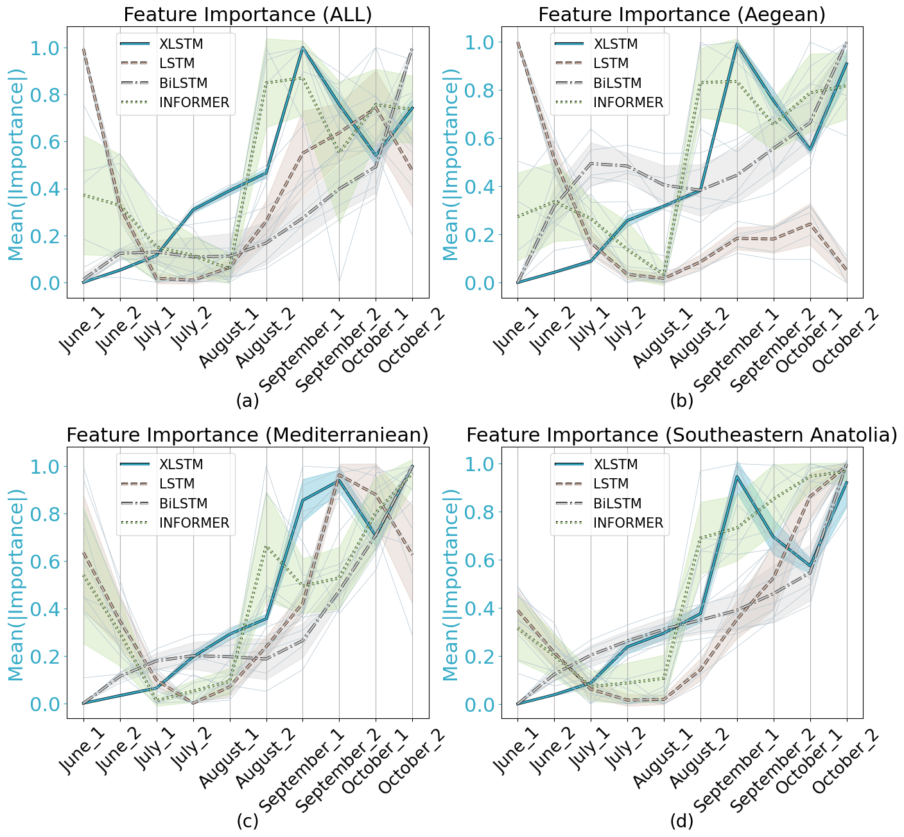
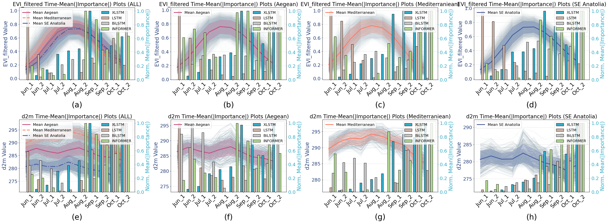
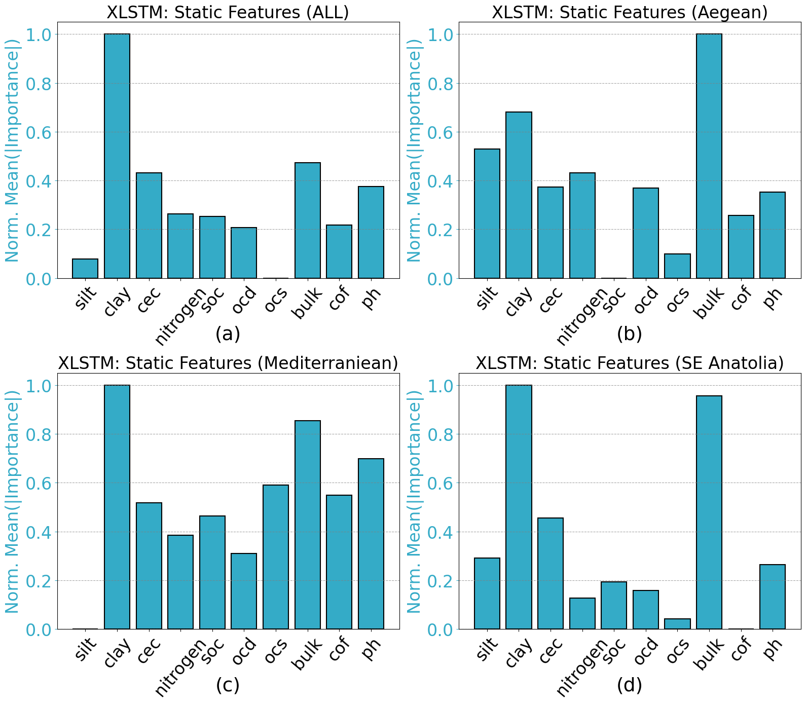

# Understanding Cotton Yield Drivers Using xLSTM

Official implementation of the paper:  
**"Understanding Cotton Yield Drivers Using xLSTM Coupled with Multi-Source Time Series Data"**  
Accepted to **IEEE Geoscience and Remote Sensing Letters (GRSL), 2025**  
Furkan Yardımcı, Mustafa Serkan Isik, Esra Erten, Alp Erturk

---

## 📄 Paper Overview

This repository presents an interpretable cotton yield prediction framework based on the extended Long Short-Term Memory (xLSTM) architecture.  
The model is trained using multi-source Earth Observation (EO) data, including:

- Optical data (Sentinel-2)
- SAR data (Sentinel-1)
- ERA5-Land meteorological variables
- SoilGrids static soil properties

### Highlights:
- Field-level cotton yield prediction (kg/da) from 2019–2023 across Turkey
- Region-specific evaluation: Aegean, Mediterranean, Southeastern Anatolia
- Comparison with LSTM, BiLSTM, and Informer models
- Gradient-based temporal saliency for interpretability

---

## ⚙️ Installation

```bash
conda create -n cottonxlstm python=3.9
conda activate cottonxlstm
pip install -r requirements.txt
```

No preprocessing is required. Preprocessed data is provided in the repository.

---

## 💻 Usage

Each model has its own compact Jupyter notebook under the `notebooks/` directory, including training, evaluation, saliency analysis, and visualization.

```bash
cd notebooks/
jupyter notebook
```

- `xlstm.ipynb`: xLSTM model  
- `lstm.ipynb`: LSTM model  
- `bilstm.ipynb`: BiLSTM model  
- `informer.ipynb`: Informer model  

Preprocessed `.npy` or `.csv` files are located in the `dataset/` directory.

---

## 📦 Dataset Description

This repository includes a preprocessed dataset created for cotton yield prediction.  
All raw features have been processed and aggregated into 15-day and 30-day intervals.

| Data Type | Temporal Resolution | Spatial Resolution | Source |
|-----------|---------------------|---------------------|--------|
| Radar backscatter (VV, VH) | 12 days | 10 m | Sentinel-1 |
| Enhanced Vegetation Index (EVI) | 5 days | 20 m | Sentinel-2 |
| Meteorological (d2m, air/soil temp, VWC, precip, evap, radiation) | 3h | 0.1° | ERA5-Land |
| Soil properties (sand, clay, SOC, pH, bulk density, etc.) | NA | 250 m | SoilGrids |
| Cotton yield (target variable) | Annual | Commune polygon | TUIK |

You can find the preprocessed feature matrices and labels in the `dataset/` folder.

---

## 📊 Key Results

| Region                  | xLSTM $R^2$ | Informer $R^2$ | xLSTM MAE | Informer MAE | xLSTM RMSE | Informer RMSE |
|-------------------------|------------|----------------|------------|----------------|-------------|----------------|
| Aegean                  | 0.71 ± 0.02 | 0.659 ± 0.036 | 16.95 ± 1.33 | 20.38 ± 2.17 | 28.80 ± 0.96 | 31.23 ± 1.58 |
| Mediterranean           | 0.87 ± 0.01 | 0.867 ± 0.019 | 10.06 ± 0.98 | 13.59 ± 1.12 | 17.55 ± 0.90 | 20.40 ± 1.53 |
| Southeastern Anatolia   | 0.88 ± 0.01 | 0.849 ± 0.015 | 11.27 ± 0.84 | 11.67 ± 0.94 | 19.78 ± 0.48 | 19.13 ± 0.87 |
| All (Combined)          | 0.85 ± 0.01 | 0.808 ± 0.008 | 12.75 ± 1.01 | 17.05 ± 0.63 | 23.74 ± 1.55 | 26.77 ± 0.45 |

<p align="center">
  
</p>

---

## 🧠 Interpretability Examples

<p align="center">
  
</p>

**Fig. 1:** Temporal analysis of EVI (top) and d2m (bottom) feature saliency across all models and regions.

<p align="center">
  
</p>

**Fig. 2:** Static feature importance distributions for xLSTM across all subregions.

---

## 🔗 Related Repositories

- [Informer (Zhou et al., 2020)](https://github.com/zhouhaoyi/Informer2020)
- [xLSTM (Hochreiter Lab)](https://github.com/NX-AI/xlstm)
- [LSTM Baseline](https://github.com/sinha96/LSTM)
- [BiLSTM Baseline](https://github.com/NUSTM/DC-BiLSTM)

---

## 📎 Citation

If you use this code or dataset in your research, please cite:

```bibtex
@article{yardimci2025cotton,
  title={Understanding Cotton Yield Drivers Using xLSTM Coupled with Multi-Source Time Series Data},
  author={Yardımcı, Furkan and Isik, Mustafa Serkan and Erten, Esra and Erturk, Alp},
  journal={IEEE Geoscience and Remote Sensing Letters},
  year={2025}
}
```

---

## 📬 Contact

For questions, feel free to contact:  
📧 furkan-yardimci1006@gmail.com
