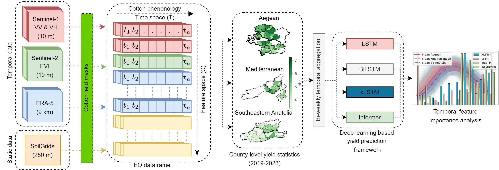
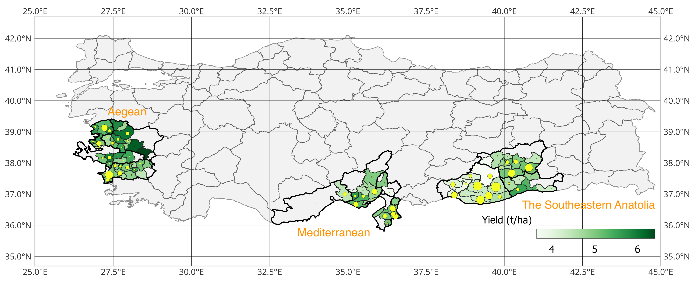
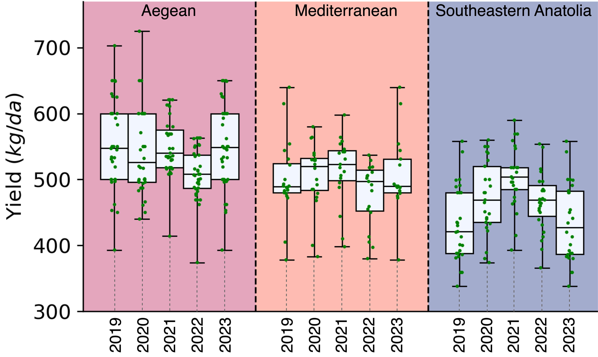

# Understanding Cotton Yield Drivers Using xLSTM

Official implementation of the study:  
**"Understanding Cotton Yield Drivers Using xLSTM Coupled with Multi-Source Time Series Data"**  
**Submitted** to **IEEE Geoscience and Remote Sensing Letters (GRSL), 2025**  
Furkan Yardımcı, Mustafa Serkan Isik, Esra Erten, Alp Erturk

---

## 📄 Overview

This repository contains the implementation of an interpretable deep learning framework for field-scale cotton yield prediction. The proposed xLSTM model leverages multi-source Earth Observation (EO) time series and environmental data to model spatiotemporal variability in yield.

> ⚠️ At this stage, **only the dataset and model code** are shared.  
> **Model outputs, performance figures, and scientific conclusions are intentionally excluded** to prevent unauthorized use prior to publication.

### 🔄 Model Workflow Overview

<p align="center">
  
</p>

<div align="center"><i>
Overall workflow of the proposed xLSTM framework, illustrating the integration of multi-source EO data, preprocessing steps, sequence construction, and yield prediction.
</i></div>

---

## ⚙️ Installation

```bash
conda create -n cottonxlstm python=3.9
conda activate cottonxlstm
pip install -r requirements.txt
```

No manual preprocessing is required. Preprocessed `.npy` or `.csv` files are included in the repository.

---

## 💻 Usage

Jupyter notebooks for model training and analysis are located in the `notebooks/` directory:

- `xlstm.ipynb`: xLSTM model training and evaluation  
- `lstm.ipynb`: Baseline LSTM  
- `bilstm.ipynb`: Bidirectional LSTM  
- `informer.ipynb`: Informer model  

```bash
cd notebooks/
jupyter notebook
```

Each notebook loads preprocessed data from the `dataset/` folder.

---

## 📦 Dataset Description

This dataset enables field-scale cotton yield estimation across Turkey by integrating dynamic and static environmental variables into a multivariate time-series structure.

### 🌍 Spatial and Temporal Scope

- **Regions:** Aegean, Mediterranean, Southeastern Anatolia — Turkey’s primary cotton zones  
- **Years:** 2019–2023 cotton seasons  
- **Target:** Annual cotton yield (kg/da), obtained from TUIK at commune level and assigned to field polygons via spatial overlay

Each sample corresponds to one field and is represented as a multivariate time series tensor. Features are aggregated into **bi-monthly intervals** (early and late parts of each month) across the phenology window (May–November), yielding fixed-length sequences for deep learning models.

### 🗺️ Regional Yield Variation

<p align="center">
  
</p>

<div align="center"><i>
The 4-year mean cotton yield variation within Türkiye, including three geographically distinct regions: from left to right — the Aegean, the Mediterranean, and Southeastern Anatolia. The circles are proportional to the total cotton-growing area in each commune. Aegean cotton is known for its premium textile production, characterized by superior fiber length, strength, and quality, whereas cotton from the Southeastern Anatolia tends to have shorter, slightly coarser fibers, making it more suitable for lower-cost textiles. (c): 10.1109/IGARSS53475.2024.10641107
</i></div>

### 📊 Yield Distribution by Region and Year

<p align="center">
  
</p>

<div align="center"><i>
Boxplots of cotton yield (kg/da) from 2019 to 2023 across three regions of Turkey: Aegean, Mediterranean, and Southeastern Anatolia. There are statistically significant differences in the distribution of cotton yields across the three regions (p &lt; 0.001), as well as some differences among years.
</i></div>

---

### 🛰️ Feature Overview

| Feature Type | Data Source | Temporal Resolution | Spatial Resolution |
|--------------|-------------|---------------------|---------------------|
| Radar backscatter (VV, VH) | Sentinel-1 | 12 days → daily interpolated | 10 m |
| Enhanced Vegetation Index (EVI) | Sentinel-2 | 5 days → daily interpolated | 20 m |
| Meteorological (d2m, temperature, VWC, radiation, etc.) | ERA5-Land | 3-hourly → daily aggregated | ~9 km |
| Soil properties (clay, sand, SOC, pH, etc.) | SoilGrids | Static | 250 m |
| Yield labels | TUIK | Annual | Commune polygon |

All EO features were extracted via **Google Earth Engine (GEE)** using annual national cotton masks.

---

### ⚙️ Preprocessing Pipeline

- **Sentinel-1:** Terrain correction using SRTM; speckle reduction via 7×7 boxcar filter  
- **Sentinel-1 & Sentinel-2:** Interpolated to daily values, smoothed with Savitzky-Golay filter  
- **ERA5-Land:** Hourly variables aggregated into daily statistics  
- **SoilGrids:** Static features repeated across time to align with dynamic inputs  
- All inputs structured as **X ∈ ℝ<sup>d×m</sup>**, where *d* is the number of features and *m* is the number of time steps

---

### 🌾 Agronomic Motivation

- Bi-monthly temporal aggregation captures key growth stages (e.g. flowering, boll development)  
- Feature design allows modeling of climatic, biophysical, and edaphic influences on yield  
- Regional diversity (soil types, farming practices, climate) enables robust and generalizable learning  
- Dataset structure supports both high-accuracy prediction and explainable model analysis

> This dataset enables interpretability-focused deep learning for agricultural forecasting by aligning rich EO data with temporal field-level outcomes.

📌 **Reference for data methodology:**  
[M. S. Isik, M. F. Celik, and E. Erten, *“Interpretable cotton yield prediction model using Earth observation time series,”* in IGARSS 2023 - IEEE International Geoscience and Remote Sensing Symposium, 2023, pp. 3442–3445.](https://ieeexplore.ieee.org/document/10281702)


---

## 🔗 Related Resources

- [Informer (Zhou et al., 2020)](https://github.com/zhouhaoyi/Informer2020)  
- [xLSTM (Hochreiter Lab)](https://github.com/NX-AI/xlstm)  
- [LSTM Baseline](https://github.com/sinha96/LSTM)  
- [BiLSTM Baseline](https://github.com/NUSTM/DC-BiLSTM)

---

## 📬 Contact

For questions, feel free to contact:  
📧 furkan-yardimci1006@gmail.com
